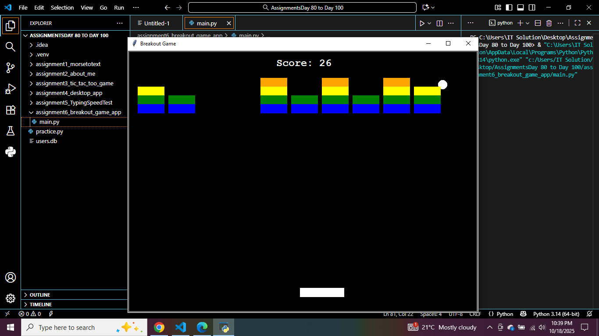
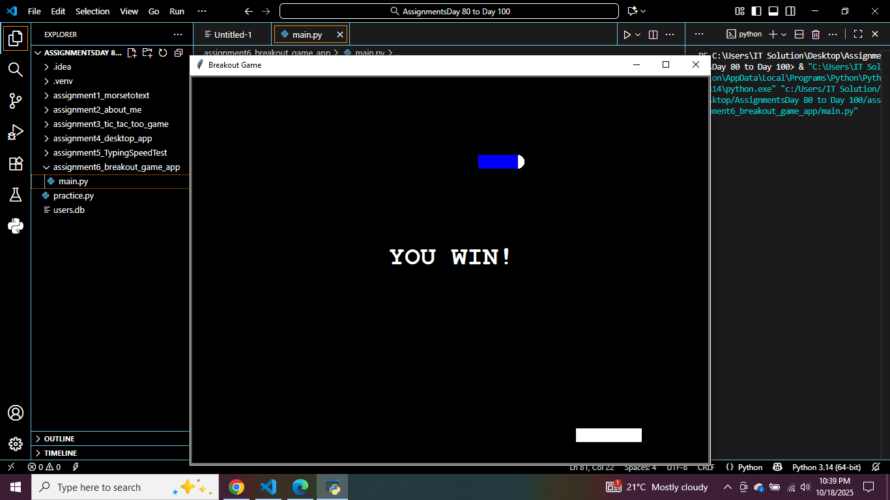

# 🧱 Breakout Game (Python Turtle)

A classic **Breakout arcade game** built using Python’s `turtle` module.  
Control the paddle, bounce the ball, and break all the colorful bricks to win!  
This project demonstrates basic game physics, collision detection, and event handling with Python.

---

## 🎮 Features
- Paddle and ball movement with smooth animation  
- Brick-breaking mechanics with collision detection  
- Score tracking and win screen  
- Simple, single-file design for easy debugging  

---

## 🖼️ Preview

### 🏠 Home Screen  

### 🏆 Win Screen  

---
